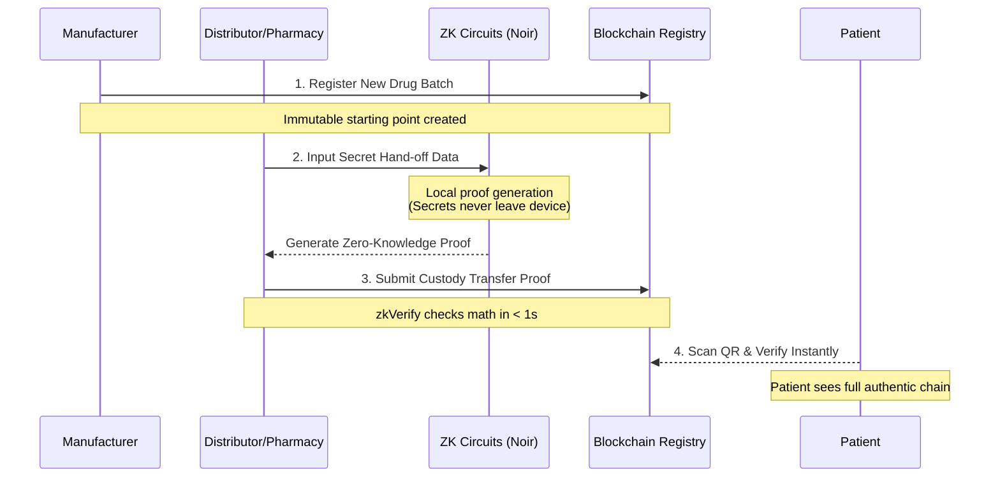

<div align="center">
  
  <h1>ZKDrugChain</h1>
  <p><b>Trustless Medicine Authentication Layer</b></p>
  <p>
    <a href="https://blrevent.vercel.app">View Live App</a> •
    <a href="#the-problem">The Problem</a> •
    <a href="#our-solution">The Solution</a> •
    <a href="#how-it-works">How It Works</a>
  </p>
</div>

---

## ⚠️ The Problem

Every year **1 in 10 medicines sold globally is fake or substandard**. People are dying from counterfeit cancer drugs, fake insulin, and diluted antibiotics — worth over **$200 billion in fraud annually**.

The current system fails because:
- **❌ QR codes on medicine boxes are easily copied** by fraudsters
- **❌ Track-and-trace databases are centralized** — any company in the chain can lie
- **❌ Patients have no way to verify** if their medicine is real at the pharmacy counter

---

## 🛡️ Our Solution — ZKDrugChain

We built a system where every medicine batch carries a **mathematical proof** — not just a sticker or QR code — that is **impossible to fake**.

Using **Noir Zero-Knowledge proofs** and **zkVerify**, we allow supply chain actors to cryptographically prove they legally received and transferred a drug batch, *without revealing sensitive trade secrets* (like wholesale pricing or supplier lists). These proofs are permanently settled on the Ethereum Sepolia blockchain.

---

## ⚡ Why This Is Different From Everything Else

| Old System | ZKDrugChain |
|---|---|
| Trust the company's database | **Trust the math** |
| QR codes can be cloned | **ZK proof cannot be faked** |
| Supply chain data is public | **Trade secrets stay private** |
| Patient can't verify anything | **Patient verifies in 2 seconds** |

---

## ⚙️ How It Works

### Step-by-Step Supply Chain Flow



### Roles & Responsibilities

| Action | Who uses it | What it does |
|---|---|---|
| **Register New Batch** | Manufacturer | Logs a new drug batch onto the blockchain with a unique ID. This is the starting point of the trust chain. |
| **Transfer Custody** | Distributor / Wholesaler | Generates a ZK proof for each handoff. Mathematically proves the transfer was legitimate without revealing identity. |
| **Admin Panel** | System Owner | Registers trusted entities into the system. Prevents random wallets from injecting fake custody records. |
| **Patient Scan** | Anyone | Opens camera, scans QR code. Instantly queries the full custody chain and shows if the medicine is Authentic. |

---

## 💻 Tech Stack

- **Frontend Builder:** Next.js App Router, Tailwind CSS, shadcn/ui
- **Zero-Knowledge Circuits:** Noir (UltraHonk)
- **ZK Verification Layer:** zkVerify
- **Blockchain Details:** Smart Contracts via Hardhat deployed to Ethereum Sepolia Testnet
- **Web3 Integrations:** Ethers.js v6

---

## 🚀 Getting Started Locally

### 1. Install Dependencies
```bash
npm install
```

### 2. Environment Variables
Create a `.env.local` file in the root directory:
```env
NEXT_PUBLIC_HORIZEN_EON_RPC=https://ethereum-sepolia-rpc.publicnode.com
NEXT_PUBLIC_CHAIN_ID=11155111
NEXT_PUBLIC_DRUG_REGISTRY_ADDRESS=0x6ca0942f898e779038540E5A25ac0970364aE52E
NEXT_PUBLIC_ZKVERIFY_PROXY=0xCb47A3C3B9Eb2E549a3F2EA4729De28CafbB2b69
```

### 3. Run the Development Server
```bash
npm run dev
```

Open [http://localhost:3000](http://localhost:3000) to view the app.

---
*© 2025 ZKDrugChain — Patient Safety Protocol*
